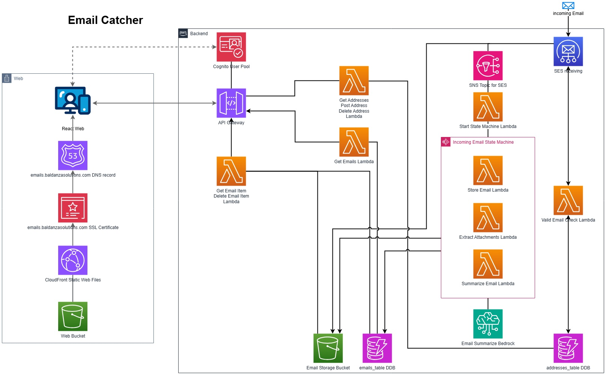

# WIP #
* Built for example purposes
* The documentation and code is work in progress
* The application functions however, it is a bit rough around the edges
  * No front end prompts when deleting emails or email addresses
  * Failures aren't really returned to the front end yet
  * etc
  

## Diagram

* First pass of the diagram
* Not all of the API routes(delete, post, etc) are mapped out in the diagram

## Walkthrough
You create an address that will be used to receive disposable emails. You can create multiple addresses. If the address exists already or belongs to another user, you won't be able to create it.

When an email comes in SES checks if the address is valid, if it is valid, it stores the email. If the email is not valid, it will silently drop the email.

When you login and view your addresses, you can go into one of the addresses. Once inside the address, you can select the emails to view. When viewing an email for the first time, if you have summarize on, it will summarize the email.

## Services and Tools
* Original CI/CD deployment method is GitLab Runner
* Uses Pulumi for IaC to deploy the environment
* Front end is built in React
* React is using Amplify UI to simplify Authentication
* AWS Cognito for user authentication
* SES to receive emails
* AWS API Gateway for API
* Lambda functions fronted by API Gateway
* S3 to store all messages
* AWS Bedrock to use Generative AI to summary emails 

## Configuration
* Assumes a route53 zone exists already, update `cloudfront_route35_zone_id` with the zone identifier
* Assumes you already have a SES rule set defined for your domain, update `ses_domain_rule_set_name` with the name of the rule set
* Update `email_domain` with the domain you wish to receive emails on
* Update `cloudfront_domain` with the domain for the web interface
* If you want to use the summary feature, your account must be allowed to use the Amazon Titan Model `amazon.titan-text-lite-v1`